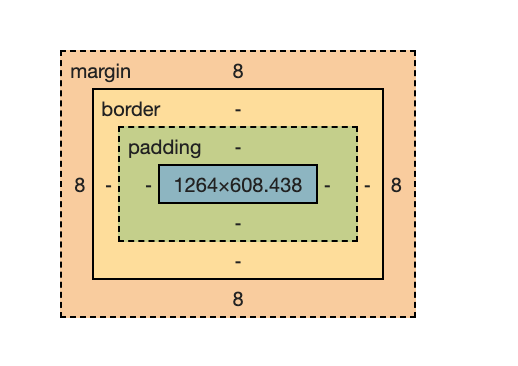

# *`background-origin`*
Com esta propriedade conseguimos definir qual será a região de origem do nosso fundo.  
Esta propriedade aceita tês valores:
>- *padding-box*
>- *border-box*
>- *content-box*

## *`background-origin: padding-box;`*
Valor padrão da propriedade, fazendo com que o elemento de fundo tenha inicio na area *padding*, não ocupando a area de borda.
```css
#padding-box {
    background-origin: padding-box;
}
```
## *`background-origin: border-box;`*
A area do elemento de fundo incuirá as bordas.
```css
#border-box {
    background-origin: border-box;
}
```

## *`background-origin: content-box;`*
O elemento que definimos como fundo ocupará somente a area do *content-box*, não ocupando a area do *padding* e nem a area das bordas.
```css
#content-box {
    background-origin: content-box;
}
```
